**1. How does Kubernetes ensure high availability compared to traditional deployment?**  


**1.** Kubernetes ensures high availability by automatically restarting failed pods, rescheduling them on healthy nodes, and maintaining desired replicas through Deployments and ReplicaSets. Unlike traditional manual server management, it handles failover and load balancing automatically.

**2.** A Pod is the smallest unit containing containers. A ReplicaSet keeps a specified number of Pods running. A Deployment manages ReplicaSets, enabling easy updates, rollouts, and rollbacks.

**3.** Services are required because Pods have changing IPs. A Service provides a stable IP/DNS name and load balances traffic to the Pods.

**4.** ConfigMaps store non-sensitive data (e.g., APP_MODE=dev), while Secrets store sensitive data.

---

### **Part 2: Cluster Setup & Verification**

**On local machine:**

```bash
minikube start --driver=docker --vm=true
```

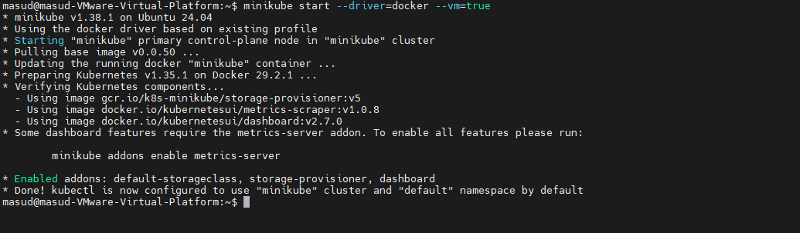

**Verification commands:**

```bash
kubectl get nodes
kubectl get pods -n kube-system
```

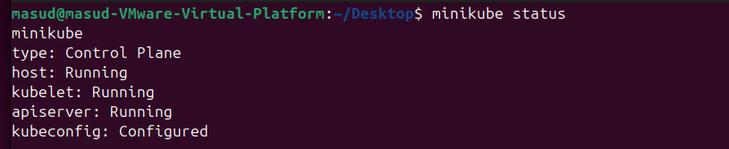
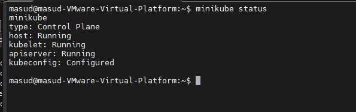
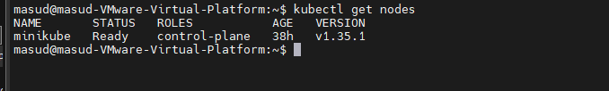
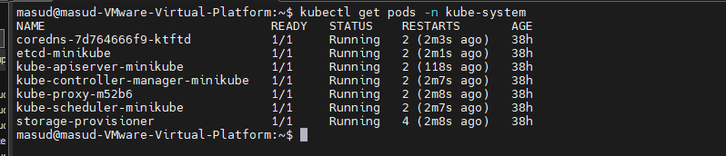

**What you should observe (write 2–3 lines):**
- Nodes: 1 node in "Ready" status.
- kube-system pods: Various pods like `coredns`, `etcd`, `kube-proxy`, `kube-apiserver` etc. are Running. This shows the core control plane and networking components are healthy.

---

### **Part 3: Multi-Resource Deployment**

#### Create files:

**nginx-deployment.yaml**
```yaml
apiVersion: apps/v1
kind: Deployment
metadata:
  name: nginx-deployment
spec:
  replicas: 2
  selector:
    matchLabels:
      app: nginx
  template:
    metadata:
      labels:
        app: nginx
    spec:
      containers:
      - name: nginx
        image: nginx:alpine
        ports:
        - containerPort: 80
```

**nginx-service.yaml**
```yaml
apiVersion: v1
kind: Service
metadata:
  name: nginx-service
spec:
  type: NodePort
  selector:
    app: nginx
  ports:
  - port: 80
    targetPort: 80
    nodePort: 30080
```

**Deploy:**

```bash
kubectl apply -f nginx-deployment.yaml
kubectl apply -f nginx-service.yaml
```

**Verify:**

```bash
kubectl get pods
kubectl get deployment
kubectl get service
kubectl get pods -o wide
```

**Access the app:**
```bash
minikube service nginx-service   # or
# For K3s: curl http://localhost:30080 or use node IP:30080
```

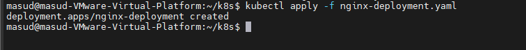
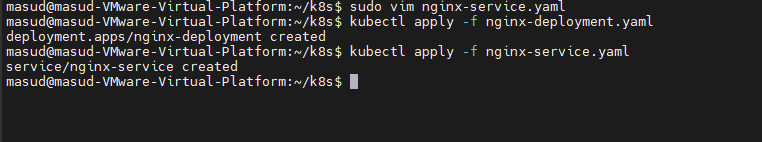

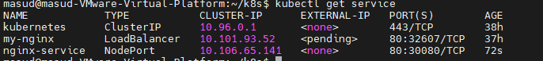

---

### **Part 4: Configuration & Secrets**

**configmap.yaml**
```yaml
apiVersion: v1
kind: ConfigMap
metadata:
  name: app-config
data:
  APP_MODE: "dev"
  LOG_LEVEL: "info"
```

**secret.yaml**
```yaml
apiVersion: v1
kind: Secret
metadata:
  name: app-secret
type: Opaque
data:
  username: admin          
  password: password
```

**Update Deployment** (add to `spec.template.spec.containers[0]`):

```yaml
        env:
        - name: APP_MODE
          valueFrom:
            configMapKeyRef:
              name: app-config
              key: APP_MODE
        - name: USERNAME
          valueFrom:
            secretKeyRef:
              name: app-secret
              key: username
        - name: PASSWORD
          valueFrom:
            secretKeyRef:
              name: app-secret
              key: password
```

Apply:

```bash
kubectl apply -f configmap.yaml
kubectl apply -f secret.yaml
kubectl apply -f nginx-deployment.yaml   # updated
```

**Verify inside container:**

```bash
kubectl exec -it <pod-name> -- env | grep -E 'APP_MODE|USERNAME|PASSWORD'
```

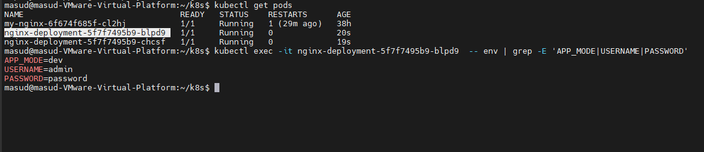

---

### **Part 5: Scaling & Rolling Updates**

```bash
# Scale
kubectl scale deployment nginx-deployment --replicas=4

# Rolling update (edit deployment or run):
kubectl set image deployment/nginx-deployment nginx=nginx:stable-alpine

# Observe
kubectl rollout status deployment/nginx-deployment
kubectl rollout history deployment/nginx-deployment
```

**Rollback:**

```bash
kubectl rollout undo deployment/nginx-deployment
```

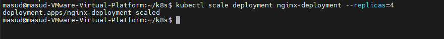
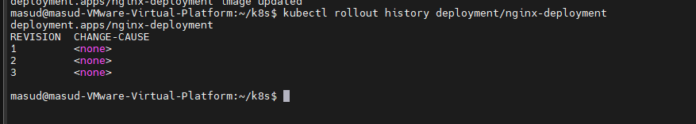

**Short explanation:**
During the update, Kubernetes creates a new ReplicaSet with the new image, gradually terminates old pods and brings up new ones (ensuring availability). Rollback reverts to the previous ReplicaSet, restoring the old image version without downtime.

---

### **Part 6: Basic Troubleshooting**

**Break it:**

```bash
kubectl set image deployment/nginx-deployment nginx=nginx:nonexistent-image
```

**Observe:**

```bash
kubectl get pods          # ImagePullBackOff or ErrImagePull
kubectl describe pod <pod-name>   # Look at Events section
kubectl logs <pod-name>
```

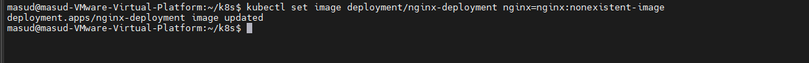
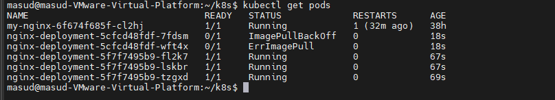

**Fix:**

```bash
kubectl set image deployment/nginx-deployment nginx=nginx:alpine
```

**Explanation (write this):**
I identified the issue using `kubectl describe pod` which showed "Failed to pull image" in Events. `kubectl logs` confirmed the pod never started. I fixed it by setting the correct image and observed the pod going back to Running.

---

### **Part 7: Namespaces**

```bash
kubectl create namespace dev-env

# Deploy in namespace
kubectl apply -f nginx-deployment.yaml -n dev-env
kubectl apply -f nginx-service.yaml -n dev-env
```

**Verify isolation:**

```bash
kubectl get pods                  # default namespace → empty
kubectl get pods -n dev-env       # shows pods
```

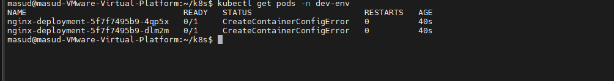

## service access

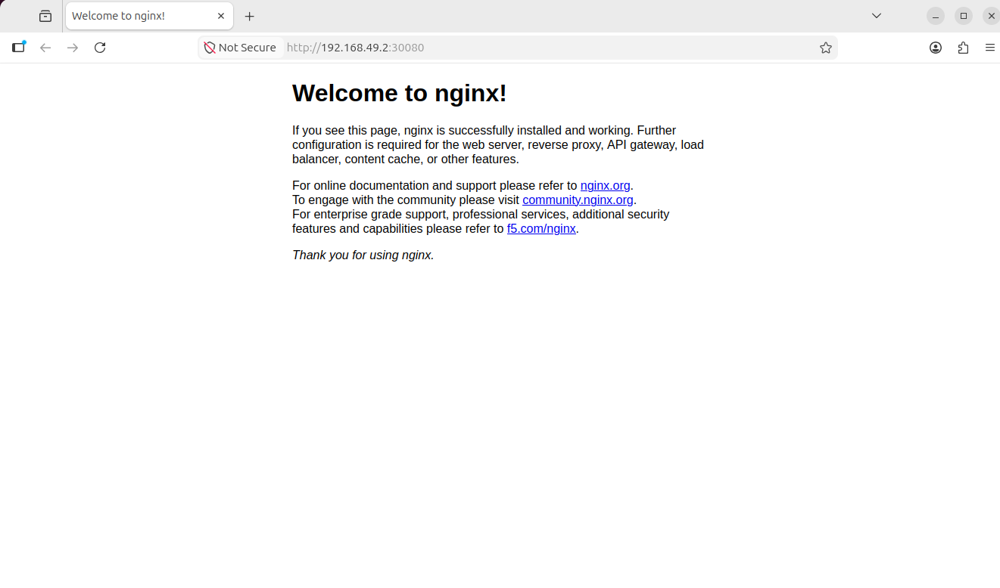


---

